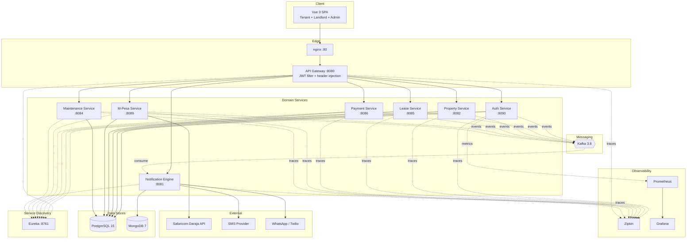
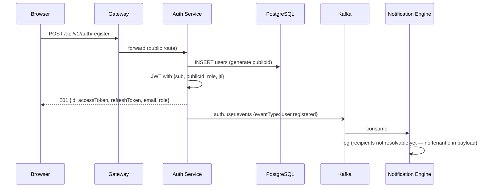
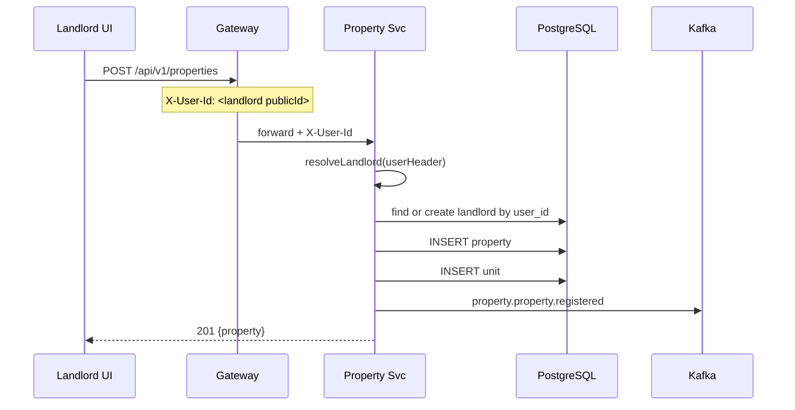
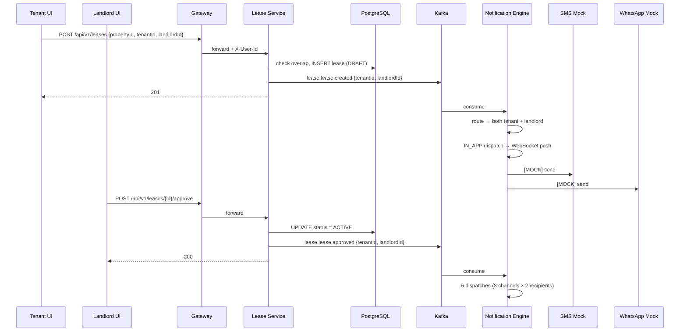
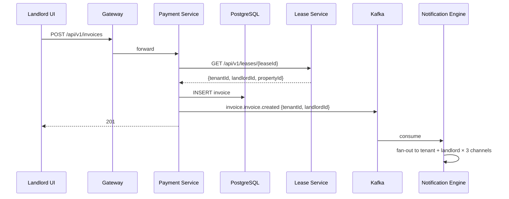
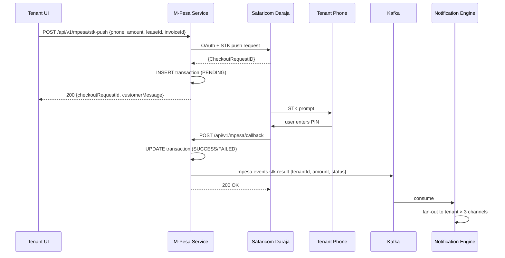
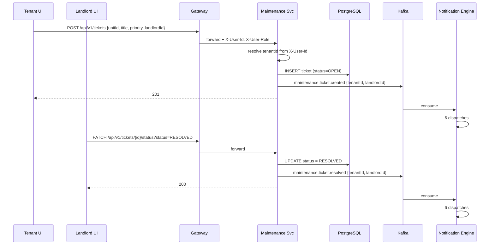
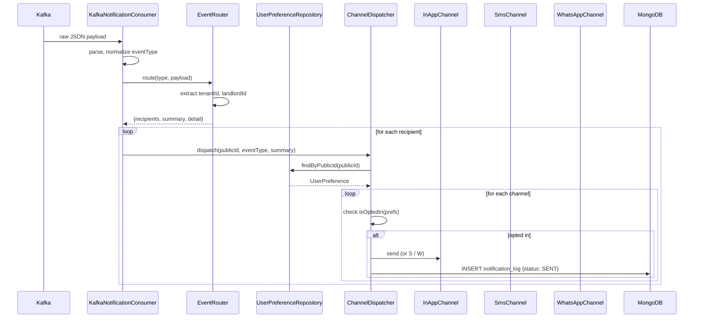

# RentFlow — System Architecture

**A tenant-landlord management platform for the Kenyan rental market.**

Handles the full rental lifecycle: property listing, tenant applications, lease approval, invoicing, M-Pesa rent collection, security deposits, and maintenance tickets — with real-time multi-channel notifications (In-App, SMS, WhatsApp).

---

## 1. Overview

RentFlow is an event-driven microservices system built on Spring Boot (backend) and Vue 3 (frontend). Services communicate both synchronously (REST through an API gateway) and asynchronously (Kafka events for domain notifications). The platform is designed around the real-world flow of Kenyan residential rentals: landlords list properties and units, tenants browse and apply, applications become leases on approval, leases generate rent invoices, and invoices are settled via Safaricom M-Pesa. Every significant domain event is broadcast on Kafka, and a dedicated notification engine fans events out to end users across In-App, SMS, and WhatsApp channels — critical for a market where SMS is the primary communication channel.

---

## 2. High-Level Architecture

### 2.1 System diagram



### 2.2 Request path (sync)

A typical authenticated API call:

1. Browser sends `POST /api/v1/invoices` with `Authorization: Bearer <JWT>`
2. **nginx** proxies to **gateway** on port 8080
3. Gateway's `JwtAuthFilter`:
   - Validates JWT signature
   - Extracts `publicId` and `role` claims
   - Injects `X-User-Id` and `X-User-Role` headers
   - Forwards to `lb://PAYMENT-SERVICE` (resolved via Eureka)
4. Payment service handles the request, writes to PostgreSQL
5. Payment service publishes an event to Kafka (async, fire-and-forget)
6. Response returns through gateway → nginx → browser

### 2.3 Event path (async)

1. Any service calls `kafkaTemplate.send(topic, key, event)`
2. **notification-engine** consumes from every domain topic
3. `EventRouter` extracts recipient UUIDs and builds a message
4. `ChannelDispatcher` fans out to opted-in channels (In-App, SMS, WhatsApp)
5. Each dispatch writes a `NotificationLog` row to MongoDB
6. In-App channel pushes via STOMP over WebSocket to the connected user

---

## 3. Services Inventory

| Service | Host Port | Container Port | Database | Purpose |
|---|---|---|---|---|
| **eureka-server** | 8761 | 8761 | — | Service registry and discovery |
| **gateway-service** | 8080 | 8080 | — | Single entry point; JWT validation; header injection; routing |
| **auth-service** | 8090 | 8080 | PostgreSQL | User registration, login, JWT issuance, refresh tokens |
| **property-management-service** | 8082 | 8082 | PostgreSQL | Properties, units, landlord records |
| **lease-service** | 8085 | 8081 | PostgreSQL | Lease lifecycle: apply, approve, terminate, renew |
| **payment-service** | 8086 | 8086 | PostgreSQL | Invoices, line items, security deposits, payment splits |
| **mpesa-service** | 8089 | 8088 | PostgreSQL | Safaricom Daraja STK push + callback handling |
| **maintainance-ticket-service** | 8084 | 8084 | PostgreSQL | Maintenance tickets |
| **notification-engine** | 8081 | 8080 | MongoDB | Event routing + multi-channel dispatch |
| **nginx** | 80 | 80 | — | Serves built frontend + reverse proxy |
| **postgres** | 5432 | 5432 | — | Shared PostgreSQL instance |
| **mongodb** | — | 27017 | — | Notification + preference storage |
| **kafka** | 9092, 29092 | 9092, 29092 | — | Event bus (KRaft mode) |
| **redis** | 6379 | 6379 | — | Caching (reserved) |
| **zipkin** | 9411 | 9411 | — | Distributed tracing UI |
| **prometheus** | 9090 | 9090 | — | Metrics scraper |
| **grafana** | 3000 | 3000 | — | Metrics dashboard |
| **kafka-exporter** | 9308 | 9308 | — | Kafka lag metrics |
| **node-exporter** | 9100 | 9100 | — | Host metrics |

**Frontend dev server:** Vite on `localhost:5173` (proxies API calls to gateway at 8080).

---

## 4. Tech Stack

### Backend
- **Java 17** — LTS, records, pattern matching
- **Spring Boot 3.3.4** — core framework
- **Spring Cloud 2023.0.6** — Gateway, Eureka, LoadBalancer
- **Spring Data JPA** — PostgreSQL persistence
- **Spring Data MongoDB** — notification + preference persistence
- **Spring Kafka 3.x** — producer + consumer
- **Spring Security** — JWT validation (gateway), method security
- **Lombok 1.18.34** — boilerplate reduction
- **MapStruct 1.5.5** — DTO ↔ entity mapping
- **Flyway 10** — migrations (disabled in dev, `ddl-auto: update` instead)
- **SpringDoc OpenAPI 2.5** — Swagger UI (available on some services)

### Frontend
- **Vue 3** + `<script setup>` + Composition API
- **TypeScript** — strict typing
- **Vite** — dev server + build tool
- **Pinia** — state management
- **Vue Router** — client routing + role guards
- **Tailwind CSS** — utility-first styling
- **Axios** — HTTP client with interceptors
- **STOMP.js** + SockJS — WebSocket client for real-time notifications

### Infrastructure
- **PostgreSQL 15** — primary relational store
- **MongoDB 7** — document store for event logs
- **Apache Kafka 3.8** (KRaft) — event bus
- **Redis 7** — reserved for caching
- **Docker Compose** — local orchestration
- **Zipkin** — distributed tracing backend
- **Prometheus + Grafana** — metrics
- **kafka-exporter** — Kafka lag metrics
- **ngrok** — public tunnel for Safaricom callbacks (dev)

---

## 5. Communication Patterns

### 5.1 Synchronous — REST through the gateway

All client traffic enters via the gateway on port 8080. Route table lives in
`GatewayApplication.java`:

| Path prefix | Target service |
|---|---|
| `/api/v1/auth/**` | AUTH-SERVICE |
| `/api/v1/users/**` | AUTH-SERVICE |
| `/api/v1/properties/**` | PROPERTY-MANAGEMENT-SERVICE |
| `/api/v1/landlords/**` | PROPERTY-MANAGEMENT-SERVICE |
| `/api/v1/units/**` | PROPERTY-MANAGEMENT-SERVICE |
| `/api/v1/leases/**` | LEASE-SERVICE |
| `/api/v1/payments/**` | PAYMENT-SERVICE |
| `/api/v1/invoices/**` | PAYMENT-SERVICE |
| `/api/v1/invoice-line-items/**` | PAYMENT-SERVICE |
| `/api/v1/security-deposits/**` | PAYMENT-SERVICE |
| `/api/v1/deposit-deductions/**` | PAYMENT-SERVICE |
| `/api/v1/payment-splits/**` | PAYMENT-SERVICE |
| `/api/v1/payment-methods/**` | PAYMENT-SERVICE |
| `/api/v1/payment-accounts/**` | PAYMENT-SERVICE |
| `/api/v1/audit-logs/**` | PAYMENT-SERVICE |
| `/api/v1/mpesa/**` | MPESA-SERVICE |
| `/api/v1/tickets/**` | MAINTENANCE-TICKET-SERVICE |
| `/api/v1/maintenance/**` | MAINTENANCE-TICKET-SERVICE |
| `/api/v1/notifications/**` | NOTIFICATION-ENGINE |

Target URIs use `lb://SERVICE-NAME` and are resolved by Eureka + Spring Cloud
LoadBalancer.

### 5.2 Synchronous — service-to-service

Rare, direct HTTP via `RestTemplate` (no Feign yet):

| Caller | Target | Purpose |
|---|---|---|
| payment-service | lease-service | Resolve `tenantId` + `landlordId` for an invoice (used to enrich `INVOICE_CREATED` events) |

URLs come from `services.lease.url` (defaults to `http://lease-service:8081`).

### 5.3 Asynchronous — Kafka event bus

**Topic naming:** `<domain>.<aggregate>.<action>` — e.g., `lease.lease.approved`.

**Producers:**

| Service | Topic | Trigger |
|---|---|---|
| auth-service | `auth.user.events` | register, login |
| lease-service | `lease.lease.created` | apply for a lease |
| lease-service | `lease.lease.approved` | landlord approves |
| lease-service | `lease.lease.terminated` | lease ends or is terminated |
| property-service | `property.property.registered` | new property created |
| payment-service | `invoice.invoice.created` | new invoice issued |
| mpesa-service | `mpesa.events.stk.result` | STK push callback arrives |
| maintenance-service | `maintenance.ticket.created` | tenant opens a ticket |
| maintenance-service | `maintenance.ticket.resolved` | landlord resolves |

**Consumers:**

Only the notification engine subscribes today. It handles all topics above
and dispatches via 3 channels.

**Event envelope:**

Every event payload carries:
```json
{
  "eventType": "lease.lease.approved",
  "correlationId": "uuid",
  "tenantId": "uuid",
  "landlordId": "uuid",
  ...domain fields (leaseId, amount, title, etc.)
}
```

**Serialization:**
- **Producer:** `JsonSerializer` (String key, JSON value)
- **Consumer:** `StringDeserializer` — listener parses with `ObjectMapper`
  - This avoids cross-service type-mapping hell (no `JsonDeserializer` +
    `TYPE_MAPPINGS` configuration needed)

---

## 6. Data Model

Each service owns its tables exclusively. No shared tables. Cross-service
consistency is achieved via REST calls (rare) or events (common).

### 6.1 PostgreSQL (`rentflow` database)

| Table | Owner service | Notes |
|---|---|---|
| `users` | auth | Long `id` (internal), UUID `public_id` (external) |
| `refresh_tokens` | auth | FK to `users.id` |
| `properties` | property-management | FK to `landlords.id` (internal UUID) |
| `units` | property-management | FK to `properties.id`; `current_tenant_id` stores publicId |
| `landlords` | property-management | UUID `id` (internal), UUID `user_id` (auth `public_id`) |
| `leases` | lease | UUID PK; `tenant_id` + `landlord_id` are user publicIds |
| `invoices` | payment | UUID PK; `lease_id` FK |
| `invoice_line_items` | payment | FK to `invoices.id` |
| `security_deposits` | payment | UUID PK; one per `lease_id` |
| `deposit_deductions` | payment | FK to `security_deposits.id` |
| `payment_splits` | payment | FK to `payments.id` and `invoices.id` |
| `payments` | payment | UUID PK; `lease_id`, `tenant_id` |
| `payment_methods` | payment | Tenant stored methods |
| `payment_accounts` | payment | Landlord bank/paybill accounts |
| `transactions` | mpesa | String `id`, `tenant_id`, `lease_id`, `invoice_id` (all string-encoded UUIDs) |
| `tickets` | maintenance | UUID PK; `tenant_id`, `landlord_id`, `unit_id` |

### 6.2 MongoDB (`notificationdb`)

| Collection | Document shape | Purpose |
|---|---|---|
| `notification_logs` | `{ _id, eventType, channel, status, payload, attempts, errorMessage, createdAt, updatedAt }` | Audit trail — one row per (user × channel × event) |
| `user_preferences` | `{ _id, publicId, fullName, email, phone, whatsappNumber, emailOptIn, smsOptIn, inAppOptIn, whatsappOptIn }` | Per-user channel opt-ins |

### 6.3 Identity mapping

The single most important cross-cutting rule:

> **All cross-service identifiers are UUIDs (`publicId`).** Internal `Long id`
> never leaves the auth-service.

| External field | Source | Type |
|---|---|---|
| `tenantId` in leases/events | `users.public_id` | UUID |
| `landlordId` in properties/leases/events | `users.public_id` | UUID |
| `userId` in preferences (Mongo) | `users.public_id` | UUID (migrated from `Long`) |

---

## 7. Event Flows

### 7.1 Auth Service — user registration & login



**Notes:**
- Login publishes `user.login` — same shape
- Auth events currently have no `tenantId`/`landlordId` — notification engine
  logs them but does not fan out
- Fix pending: add `publicId` to auth event payloads

### 7.2 Property Service — landlord creates a property



**Notes:**
- `landlord.user_id` = the auth publicId — this is the join key across services
- The property DTO returns `landlord.getUserId()` (publicId), not the internal landlord `id`

### 7.3 Lease Service — tenant applies, landlord approves



### 7.4 Payment Service — landlord creates invoice



**Notes:**
- The cross-service lease lookup is **fail-soft**: if lease-service is down,
  the invoice is still created; the event just has null recipients

### 7.5 M-Pesa Service — tenant pays via STK push



**Notes:**
- Callback URL is a public ngrok tunnel in dev (`DARAJA_CALLBACK_URL`)
- `landlordId` is currently **null** in the event — two-sided M-Pesa
  notification is pending
- Safaricom retries on non-200 → callback endpoint must always return 200

### 7.6 Maintenance Service — tenant opens ticket, landlord resolves



### 7.7 Notification Engine — dispatch flow



---

## 8. Cross-Cutting Concerns

### 8.1 Authentication

**JWT structure** (HS512):
```json
{
  "jti": "uuid (unique per token)",
  "sub": "user@email.com",
  "publicId": "uuid (auth users.public_id)",
  "role": "TENANT | LANDLORD | ADMIN",
  "iat": 1790000000,
  "exp": 1790000900
}
```

- **Access token:** 15 minutes
- **Refresh token:** 7 days, stored in `refresh_tokens` table
- **Refresh flow:** old token revoked on use, new one issued (rotation)

**Where validation happens:**
- Only at the gateway (`JwtAuthFilter`)
- Downstream services trust the headers `X-User-Id` and `X-User-Role`
- Public paths whitelisted in `JwtAuthFilter.PUBLIC_PATHS`:
  `/api/v1/auth/login`, `/register`, `/refresh`, `/actuator`

### 8.2 Multi-Tenancy

- Header `X-Tenant-ID` currently hardcoded to `default` by frontend
- Header `X-User-Id` = the JWT's `publicId` claim
- Header `X-User-Role` = the JWT's `role` claim

**Role-based auto-scoping** — services receive these headers and filter queries:

```java
// LeaseController.listLeases()
if ("TENANT".equalsIgnoreCase(userRole) && tenantId == null) {
    tenantId = callerId;      // auto-scope to caller
} else if ("LANDLORD".equalsIgnoreCase(userRole) && landlordId == null) {
    landlordId = callerId;
}
```

**Critical rule:** never parse `X-Tenant-ID` as a UUID — it's `"default"`. Always
wrap header-to-UUID conversion in try/catch.

### 8.3 Distributed Tracing

- **Framework:** Micrometer Tracing + Brave
- **Propagation:** B3 (Zipkin-native)
- **Sampling:** 100% in dev
- **Backend:** Zipkin at `http://zipkin:9411`
- **Log correlation:** every log line includes `[service-name,traceId,spanId]`

Every service's `logging.pattern.console` is:
```
%d{yyyy-MM-dd HH:mm:ss} [${spring.application.name},%X{traceId:-},%X{spanId:-}] - %msg%n
```

### 8.4 Metrics & Monitoring

- **Format:** Micrometer → Prometheus scrape endpoint at `/actuator/prometheus`
- **Aggregation:** Prometheus (9090) scrapes every service every 15s
- **Dashboards:** Grafana at `localhost:3000` (admin/admin)
- **Custom metrics:** HTTP server request histograms with SLO buckets
  `100ms, 500ms, 1s, 5s`
- **Kafka lag:** kafka-exporter (9308) scraped by Prometheus

### 8.5 Health Checks

Every service exposes `/actuator/health` with details. Docker healthcheck
interval: 30s, start-period 40s, 3 retries.

**Common gotchas:**
- Notification engine takes 3–4 min to boot — healthcheck shows `unhealthy`
  for a while before flipping
- `mail` health indicator disabled (no SMTP configured in dev)

### 8.6 Error Handling

- **Domain exceptions** per service map to HTTP statuses via `@RestControllerAdvice`
  - `ResourceNotFoundException` → 404
  - `BusinessException` / `ValidationException` → 400
  - `LeaseOverlapException` → 409
- **Kafka consumers:** `DefaultErrorHandler` retries 3× with 2s backoff, then
  drops the message (logged as DLQ candidate)
- **Callbacks:** M-Pesa callback always returns 200, even on error, to prevent
  Safaricom retry storms

### 8.7 Security Considerations

- **Gateway strips** incoming `X-User-Id` / `X-User-Role` — the client cannot
  forge identity
- **CSRF disabled** — stateless JWT API
- **CORS** configured at gateway for `http://localhost:5173`
- **WebSocket auth** — pending (STOMP `ChannelInterceptor` needed)
- **Secrets** — all via env vars, never committed (`.env` gitignored)
- **Passwords** — bcrypt hashed

---

## 9. Deployment

### 9.1 Local development

**Full stack:**
```bash
docker compose up -d
```

**Frontend dev (Vite with HMR):**
```bash
cd .github/workflows/tenant-frontend
npm run dev      # http://localhost:5173
```

**Frontend prod (nginx via Docker):**
```bash
cd .github/workflows/tenant-frontend
npm run build    # outputs dist/
docker compose up -d nginx
```

### 9.2 Ports map

| Purpose | Port |
|---|---|
| Frontend (nginx prod) | http://localhost |
| Frontend (Vite dev) | http://localhost:5173 |
| API Gateway | http://localhost:8080 |
| Eureka dashboard | http://localhost:8761 |
| Grafana | http://localhost:3000 |
| Prometheus | http://localhost:9090 |
| Zipkin | http://localhost:9411 |
| Kafka (external) | localhost:9092 |

### 9.3 Environment variables (`.env`)

```bash
# --- JWT ---
JWT_ACCESS_SECRET=<64-char-hex>
JWT_REFRESH_SECRET=<64-char-hex>

# --- Database ---
SPRING_DATASOURCE_USERNAME=rentflow
SPRING_DATASOURCE_PASSWORD=<password>
SPRING_DATA_MONGODB_URI=mongodb://mongodb:27017/notificationdb

# --- Kafka ---
SPRING_KAFKA_BOOTSTRAP_SERVERS=kafka:29092

# --- Eureka ---
EUREKA_CLIENT_SERVICEURL_DEFAULTZONE=http://eureka-server:8761/eureka/

# --- Safaricom Daraja ---
DARAJA_CONSUMER_KEY=<sandbox-key>
DARAJA_CONSUMER_SECRET=<sandbox-secret>
DARAJA_PASSKEY=<sandbox-passkey>
DARAJA_SHORTCODE=174379
DARAJA_CALLBACK_URL=https://<ngrok-subdomain>.ngrok-free.dev/api/v1/mpesa/callback

# --- Tracing ---
ZIPKIN_URL=http://zipkin:9411/api/v2/spans

# --- Frontend (build-time) ---
VITE_API_URL=http://localhost:8080
VITE_TENANT_ID=default
```

### 9.4 Startup order

Docker Compose `depends_on` handles this, but for manual restarts:

1. **Data layer:** postgres, mongodb, redis, kafka
2. **Discovery:** eureka-server
3. **Services:** auth, property, lease, payment, mpesa, maintenance
4. **Gateway:** gateway-service
5. **Async:** notification-engine
6. **Edge:** nginx
7. **Observability:** prometheus, grafana, zipkin

Wait 30–60 seconds between steps 2 and 3 — Eureka discovery needs time.

### 9.5 Common dev operations

```bash
# Restart one service after code change
docker compose build --no-cache <service-name>
docker compose up -d <service-name>

# View logs
docker logs -f rentflow-<service>

# Check health
curl http://localhost:<host-port>/actuator/health

# Rebuild common JAR + redistribute (CRITICAL after common/ changes)
./mvnw -pl common clean package -DskipTests
find . -path "*/libs/common-1.0.0-SNAPSHOT.jar" -not -path "*/target/*" \
  -exec cp common/target/common-1.0.0-SNAPSHOT.jar {} +
docker compose build --no-cache <affected-services>
```

### 9.6 Dev tunnel for Safaricom callbacks

Safaricom requires a public HTTPS URL for the callback:

```bash
# Terminal 1 — ngrok forwarding to mpesa-service
ngrok http 8089

# Copy the https://...ngrok-free.dev URL into .env as DARAJA_CALLBACK_URL
docker compose up -d --force-recreate mpesa-service
```

**Warning:** ngrok free URLs rotate on every restart. Must update `.env` and
restart mpesa-service each time.

---

## 10. Key Architecture Decisions

| # | Decision | Rationale | Trade-off |
|---|---|---|---|
| 1 | **Kafka for notifications** | Decouples producers from channel logic; adding a channel doesn't touch publishers | Operational overhead of Kafka cluster |
| 2 | **StringDeserializer + manual JSON parse** | Avoids `JsonDeserializer` + `TYPE_MAPPINGS` maintenance across 9 services | Slightly more code per consumer, no compile-time type safety |
| 3 | **UUID `publicId` as external user ID** | Stable across services; safe to expose; Long IDs stay internal to auth | Requires backfill migration on existing users |
| 4 | **Gateway injects `X-User-Id`** | Services never parse JWT; single source of truth for identity | Gateway becomes a critical dependency |
| 5 | **Per-service table ownership, shared PostgreSQL instance** | Simple in dev; each service fully owns its schema | Not fully isolated — one DB failure affects all |
| 6 | **MongoDB for notification logs** | Flexible schema for heterogeneous event payloads; write-optimized | Second DB to operate |
| 7 | **Channel abstraction (`NotificationChannel`)** | New channels are drop-in; mocks for dev | Slight indirection |
| 8 | **Mock SMS/WhatsApp in dev** | No external provider accounts needed to develop | Behaviour differs from production |
| 9 | **Fail-soft event publish** | Request succeeds even if Kafka is down (invoice still created) | Events may be lost; no outbox pattern yet |
| 10 | **Saga-less lease flow** | Apply → approve is 2 calls, not a long-running saga | Simpler but requires DB cleanup for abandoned drafts |
| 11 | **B3 propagation** | Native Zipkin format, zero config | Not W3C standard |
| 12 | **Role-based query auto-scoping** | Prevents tenants/landlords seeing each other's data with zero client code | Every list endpoint must implement the pattern |

---

## 11. Directory Layout

```
tenant-landlord-system/
├── ARCHITECTURE.md              ← this file
├── docker-compose.yml
├── .env
├── .dockerignore
├── pom.xml                      ← parent POM (multi-module)
├── mvnw, mvnw.cmd
│
├── common/                      ← shared event classes
│   ├── pom.xml
│   └── src/main/java/com/platform/common/
│       ├── events/
│       │   ├── lease/           LeaseCreatedEvent, LeaseApprovedEvent, LeaseTerminatedEvent
│       │   ├── maintenance/     TicketCreatedEvent, TicketResolvedEvent
│       │   ├── billing/         PaymentReceivedEvent, PaymentFailedEvent, PaymentInitiatedEvent
│       │   ├── mpesa/           StkPushRequestedEvent, StkPushResultEvent
│       │   └── property/        PropertyRegisteredEvent, PropertyUpdatedEvent
│       └── constants/           KafkaTopics, etc.
│
├── eureka-server/
├── gateway-service/
│   └── src/main/java/com/rentflow/gateway/
│       ├── GatewayApplication.java    ← all routes defined here
│       └── filter/JwtAuthFilter.java
│
├── auth-service/
│   └── src/main/java/com/apex/auth/
│       ├── entity/User.java
│       ├── service/JwtService.java
│       ├── service/AuthenticationService.java
│       ├── service/UserEventConsumer.java
│       └── libs/common-*.jar    ← stale copy, must be refreshed
│
├── property-management-service/
├── lease-service/
├── payment-service/
├── mpesa-service/
├── maintainance-ticket-service/    ← intentional misspelling (matches module name)
├── notification-engine/
│   └── src/main/java/com/property/notification/
│       ├── listener/KafkaNotificationConsumer.java
│       ├── service/EventRouter.java
│       ├── service/ChannelDispatcher.java
│       ├── service/channel/       InAppChannel, SmsChannel, WhatsAppChannel
│       ├── domain/NotificationEventType.java
│       ├── domain/NotificationLog.java
│       ├── domain/UserPreference.java
│       └── config/PreferenceBootstrap.java
│
├── .github/workflows/tenant-frontend/    ← Vue 3 SPA
│   ├── src/
│   │   ├── api/          axios clients per domain
│   │   ├── stores/       Pinia: auth, notification, property
│   │   ├── views/        route components
│   │   │   ├── Auth/
│   │   │   ├── Tenant/
│   │   │   └── Landlord/
│   │   ├── components/
│   │   │   ├── layout/   AppLayout
│   │   │   ├── property/
│   │   │   ├── lease/    LeaseCard
│   │   │   └── common/   BaseButton, BaseInput
│   │   ├── router/       routes + role guards
│   │   └── types/        TypeScript interfaces
│   ├── index.html
│   ├── vite.config.ts
│   ├── tailwind.config.js
│   └── package.json
│
└── observability/
    ├── prometheus/
    │   └── prometheus.yml
    └── grafana/
        └── provisioning/
```

---

## 12. Gotchas & Lessons Learned

These are the traps we hit during development — document them so nobody repeats them.

1. **`common/` JAR must be redistributed manually.** Each service copies a
   prebuilt JAR at Docker build time from `libs/common-1.0.0-SNAPSHOT.jar`.
   After changing `common/`:
   ```bash
   ./mvnw -pl common clean package -DskipTests
   find . -path "*/libs/common-1.0.0-SNAPSHOT.jar" -not -path "*/target/*" \
     -exec cp common/target/common-1.0.0-SNAPSHOT.jar {} +
   docker compose build --no-cache <affected-services>
   ```

2. **Never exclude snappy/lz4/zstd from `spring-kafka`.** Kafka's producer eagerly
   loads compression codecs at first `send()`. Excluding them causes:
   ```
   NoClassDefFoundError: org/xerial/snappy/SnappyOutputStream
   ```

3. **JWT must include both `publicId` AND `role`.** The gateway reads both to
   inject `X-User-Id` and `X-User-Role`. Missing either breaks authorization
   silently (users see empty lists instead of errors).

4. **Notification-engine boot time is ~3–4 minutes.** Docker healthcheck shows
   `unhealthy` for the first 2–3 min after `up -d`. Do not panic-restart; wait.

5. **Kafka producer key must be a `String`.** Passing a raw `UUID` throws
   `SerializationException: Can't convert key of class java.util.UUID to class
   StringSerializer`. Always `.toString()` before `send()`.

6. **`X-Tenant-ID` is not a UUID.** It is `"default"` in dev. Any code that
   does `UUID.fromString(tenantHeader)` must wrap in try/catch. Same applies
   to `X-User-Id` if it might be an email.

7. **Long `id` vs UUID `publicId`.** Auth-service uses `Long` as the JPA `@Id`
   but exposes `UUID publicId` externally. Cross-service calls always use
   `publicId`. Never confuse the two.

8. **Safaricom callback URL must be publicly reachable.** `localhost` will not
   work — use ngrok. Also, ngrok free URLs rotate on restart; update `.env` and
   force-recreate mpesa-service each time.

9. **Frontend `.github/workflows/tenant-frontend/` path is unusual but real.**
   Frontend source lives inside the workflows folder by accident of history —
   do not move it without updating all build references.

10. **`maintainance` (typo) is intentional.** The service module is named
    `maintainance-ticket-service`. Renaming would break Maven module
    resolution and all Docker references. Leave it.

---

## 13. Roadmap

| Feature | Status | Notes |
|---|---|---|
| Full rental lifecycle (property → lease → invoice → pay → maintenance) | ✅ Done | Verified end-to-end |
| Event bus with In-App + SMS + WhatsApp channels | ✅ Done | Mocks in dev |
| Two-sided notifications (tenant + landlord) | ✅ Partial | All except M-Pesa |
| M-Pesa landlordId in payment notifications | ⏳ | Requires cross-service lookup at STK-push time |
| Frontend real-time notification UI (bell + toast + page) | ⏳ | STOMP subscription pending |
| Real SMS provider integration (Africa's Talking) | ⏳ | Needs account approval |
| Real WhatsApp integration (Twilio) | ⏳ | Needs WhatsApp Business approval |
| Landlord tenant-name display (currently UUID) | ⏳ | Needs user-lookup endpoint in auth |
| Payment split production fix (real Payment records) | ⏳ | Currently stores M-Pesa tx id |
| Landlord Tenants view — polish | ⏳ | Wired but minimal |
| Admin dashboard | ⏳ | Routes exist, stub pages |
| Automated test suite | ⏳ | 0 tests currently |
| Outbox pattern for event publishing | ⏳ | Would prevent event loss if Kafka is down |
| WebSocket JWT authentication | ⏳ | STOMP ChannelInterceptor needed |

---

## 14. Glossary

| Term | Meaning |
|---|---|
| **Tenant** | Person renting a unit (role: `TENANT`) |
| **Landlord** | Owner of property/unit (role: `LANDLORD`) |
| **Admin** | Platform operator (role: `ADMIN`) |
| **Property** | Building or address (has many units) |
| **Unit** | Individual rentable space within a property |
| **Lease** | Contract between tenant and landlord for a unit |
| **Invoice** | Bill issued by landlord to tenant for a period |
| **Security deposit** | Refundable amount held against damages |
| **STK Push** | Safaricom's SIM Toolkit prompt for M-Pesa PIN entry |
| **Daraja** | Safaricom's public M-Pesa API platform |
| **publicId** | UUID exposed externally for a user (vs internal `Long id`) |
| **Event bus** | Kafka topics used to broadcast domain events |
| **Fail-soft** | Request succeeds even if the async side-effect fails |
| **DLQ** | Dead Letter Queue — where failed messages go after retries |

---

_Last updated: 2026-10-03 · Maintained as part of the RentFlow project._